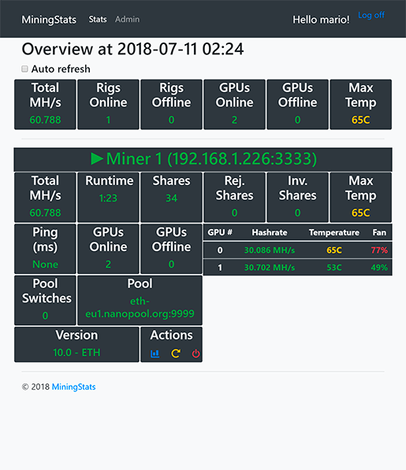
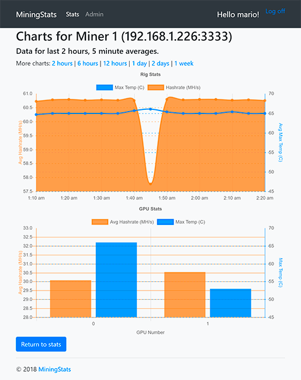

# MiningStats - ETH Mining Monitoring

A simple Python 3/Django app for Ethereum mining monitoring.

## Supported miners

* Claymore
* Phoenix miner

## Features

* Real-time dashboard of multiple mining rigs
* Remote triggering of miner restarts or rig reboots
* Tracking of hashrate and temperatures per rig or per graphics card
* Historical charts
* Responsive
* Low requirements (can run on a Raspberry Pi, for example)
* Works offline (no external JS/CSS used)

## Screenshots

Dashboard                  |  Charts
:-------------------------:|:-------------------------:
  | 

## Status

This project is currently in **beta**. Please test and report issues/submit PRs.

## Getting Started

### Initial Setup

You'll need nginx, PostgreSQL, Python 3, pip and virtualenv:

```bash
sudo apt install nginx postgresql python3 python3-pip
sudo pip3 install virtualenv
```

Create a PostgreSQL user and database:

```bash
sudo -u postgres createuser mining_stats
sudo -u postgres psql -U postgres -d postgres -c "ALTER USER mining_stats WITH PASSWORD 'minetest';"
sudo -u postgres createdb -O mining_stats mining_stats
```

Set environment variables by executing `nano ~/env` and defining appropriate values, e.g.:

```ini
MS_SECRET_KEY=1e5afa31-f917-40cd-ae98-61fe319418a7
MS_DB_HOST=localhost
MS_DB_PORT=5432
MS_DB_NAME=mining_stats
MS_DB_USER=mining_stats
MS_DB_PASSWORD=minetest
MS_TZ=Etc/UTC
```

### Create the virtualenv and activate it

```bash
virtualenv msenv
source msenv/bin/activate
```

### Clone repository and install dependencies 

```bash
git clone https://github.com/bitmario/mining-stats
cd mining-stats
pip3 install -r requirements.txt
```

### Run migrations, collect static files and create admin user

We first need to source and export the environment variables:

```bash
set -a; source ~/env; set +a
```

Now we run the required operations:

```bash
python3 manage.py migrate
python3 manage.py collectstatic
python3 manage.py createsuperuser
```

### Schedule data collection

Edit your cron (run `crontab -e`) to set the shell as Bash and run our jobs, e.g.:

```bash
SHELL=/bin/bash
*/1 * * * *    source /home/user/msenv/bin/activate && set -a && source /home/user/env && set +a && python3 /home/user/mining-stats/manage.py runcrons
```

### Test the server

```bash
python3 manage.py runserver 0.0.0.0:8000
```

You should now be able to access the server at *http://YOUR_IP:8000*. If you got here, congratulations! The hard part is over, stop the service (`CTRL + C`) and keep reading.

### Create the deployment service

Create a new systemd service (e.g. `sudo nano /etc/systemd/system/gunicorn.service`):

```ini
[Unit]
Description=gunicorn daemon
After=network.target

[Service]
User=user
Group=user
WorkingDirectory=/home/user/mining-stats/
EnvironmentFile=/home/user/env
ExecStart=/home/user/msenv/bin/gunicorn --access-logfile - --workers 3 --bind unix:/home/user/mining_stats.sock mining_stats.wsgi:application

[Install]
WantedBy=multi-user.target
```

Now enable and start the service:

```bash
sudo systemctl enable gunicorn.service
sudo systemctl start gunicorn.service
```

### Set up nginx

Let's create a new server in the `sites-available` directory:

```bash
sudo nano /etc/nginx/sites-available/mining-stats
```

Your config should be similar to the following:

```nginx
server {
    listen 8000 default_server;

    location = /favicon.ico { access_log off; log_not_found off; }
    location /static/ {
        root /home/user/mining-stats;
    }

    location / {
        include proxy_params;
        proxy_pass http://unix:/home/user/mining_stats.sock;
    }
}
```

Enable the site and restart nginx:

```bash
sudo ln -s /etc/nginx/sites-available/mining-stats /etc/nginx/sites-enabled
sudo systemctl restart nginx
```

### Configure options and rigs

The technical part is done, now we just need to configure the system:

1. Access the MiningStats server and log in with the superuser account that you created
2. Click the *Admin* link on the page header
3. Select *Site configuration* under *App*
4. Set the desired options and click on *Save*
5. Select *Rigs*, under *App* and click on *Add Rig* in the upper right corner
6. Enter the rig information and save

### Done!

MiningStats will now collect information from your rigs every minute, and provide real-time and historical insights.

## Contributing

1. Fork it!
2. Create your feature branch: `git checkout -b my-new-feature`
3. Commit your changes: `git commit -am 'Add some feature'`
4. Push to the branch: `git push origin my-new-feature`
5. Submit a pull request

## Authors

* **Mario Falcao** - *Initial work* - [bitmario](https://github.com/bitmario)

See also the list of [contributors](https://github.com/bitmario/mining-stats/contributors) who participated in this project.

## License

This project is licensed under the MIT License - see the [LICENSE.md](LICENSE.md) file for details
